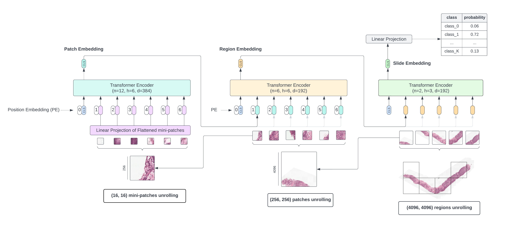
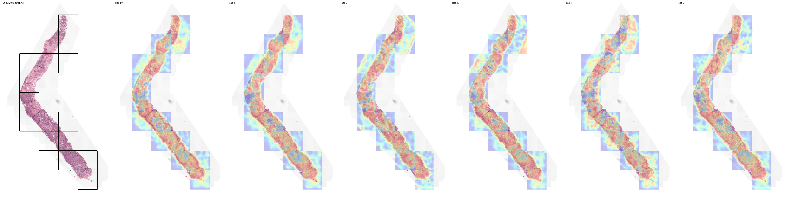

<h1 align="center">Hierarchical Image Pyramid Transformer</h1>


Re-implementation of original [HIPT](https://github.com/mahmoodlab/HIPT) code.

<p>
   <a href="https://github.com/psf/black"></a>
   <a href="https://github.com/PyCQA/pylint"></a>
</p>



## Requirements

- python 3.9+
- install requirements via `pip3 install -r requirements.txt`
- install module via `pip3 install -e .`

## Prerequisite

You need to have extracted square regions from each WSI you intend to train on.<br>
To do so, you can take a look at [HS2P](https://github.com/clemsgrs/hs2p), which segments tissue and extract relevant patches at a given pixel spacing.

Download HIPT pre-trained weights via the following commands:

<details>
<summary>
Download commands
</summary>

```
mkdir checkpoints
cd checkpoints
gdown 1Qm-_XrTMYhu9Hl-4FClaOMuroyWlOAxw
gdown 1A2eHTT0dedHgdCvy6t3d9HwluF8p5yjz
```
</details>

## Feature Extraction

**1. [Optional] Configure wandb**

If you want to benefit from wandb logging, you need to follow these simple steps:
 - grab your wandb API key under your wandb profile
 - run the following command in your terminal: `export WANDB_API_KEY=<your_personal_key>`
 - update wandb parameters in the relevant `.yaml` config files (see next)

**2. Extract features**

Your folder containing the extracted square regions should be structured as follow:

<details>
<summary>
Folder structure
</summary>

```bash
region_dir/
├── slide_1/
│     ├── slide_1.h5
│     └── imgs/
│          ├── region_1.fmt
│          ├── region_2.fmt
│          └── ...
├── slide_2/
├── slide_3/
└── ...
```
</details>

Create a configuration file under `config/feature_extraction/` taking inspiration from existing files.<br>
A good starting point is to use the default configuration file `config/default.yaml` where parameters are documented.

- extract region-level features : make sure to set `level: 'global'` in your config.<br>
- extract patch-level features : make sure to set `level: 'local'` in your config.<br>

Then run the following command to kick off feature extraction:

```bash
python3 extract_features.py --config-name <feature_extraction_config_filename>
```

This will produce one `.pt` file per slide and save it under `output/<experiment_name>/<experiment_id>/slide`.<br>
If you set `save_region_features` to True in your config file, it will also produce one `.pt` file per region and save it under `output/<experiment_name>/<experiment_id>/region`. In the end, the output folder should look like:

```
hipt/
├── output/<experiment_name>/<experiment_id>/features/
│     ├── slide/
│     │    ├── slide_1.pt
│     │    ├── slide_2.pt
│     │    └── ...
│     └── region/
│          ├── slide_1_x1_y1.pt
│          ├── slide_1_x2_y2.pt
│          └── ...
```

If you encounter OOM errors while extracting region-level features, it could be that the model is too big to fit on your gpu. In that case, work with 2 gpus and enable model split across gpus setting `split_across_gpus: True` in your config file.

**Distributed** feature extraction across multiple gpus is supported via:

```bash
python3 -m torch.distributed.run --standalone --nproc_per_node=gpu extract_features.py --config-name <feature_extraction_config_filename>
```

## HIPT Training

**1. Prepare `train.csv` and `tune.csv`**

For this pipeline you will need two csv files: `train.csv` and `tune.csv`.<br>
The syntax is easy:

```
slide_id,label
TRAIN_1,1
TRAIN_2,0
...
```

If you want to run testing at the end, you can provide a `test.csv` file.<br>

**2. Train a *single-fold* model on extracted features**

Once features have been extracted, create a configuration file under:

- `config/training/classification` for training a classification model
- `config/training/survival` for training a survival prediction model

You can take inspiration from `single.yaml` files.<br>
Dump in there the paths to your `train.csv` and `tune.csv` files.<br>
If you want to run testing as well, add the path to your `test.csv` file. Otherwise, leave it blank (it'll skip testing).

Then, run the following command to kick off model training on a single fold:

- classification: `python3 train/classification.py --config-name <classification_single_fold_config_filename>`
- survival: `python3 train/survival.py --config-name <survival_single_fold_config_filename>`

Once again, if you encounter OOM errors here, it could be that the model is too big to fit on your gpu. In that case, work with 2 gpus and enable model split across gpus setting `split_across_gpus: True` in your config file.

**3. Train a *multi-fold* model on extracted features**

Your multiple folds should be structured as follow:

<details>
<summary>
Folds structure
</summary>

```bash
fold_dir/
├── fold_1/
│     ├── train.csv
│     ├── tune.csv
│     └── test.csv
├── fold_2/
└── ...
```
</details>

Create a configuration file under:

- `config/training/classification` for training a classification model
- `config/training/survival` for training a survival prediction model

You can take inspiration from `multi.yaml` files.<br>
Remember to indicate the root directory where your folds are located under `data.fold_dir`.<br>

Then, run the following command to kick off model training on multiple folds:

- classification: `python3 train/classification_multi.py --config-name <classification_multi_fold_config_filename>`
- survival: `python3 train/survival_multi.py --config-name <survival_single_fold_config_filename>`

## Interpretability via Attention Heatmaps



Given HIPT consists in 3 Transformers stacked on one another, one can look at attention heatmaps for each Transformer independantly. Additionally, one can also blend these attention heatmaps together and generate **factorized** attention heatmaps.<br>
<br>
To generate attention heatmaps, create a configuration file under `config/heatmaps`.<br>
You can take inspiration from `default.yaml`, where all entries should be documented.<br>

Then, run the following command to kick off attention heatmap generation:

```bash
python3 attention_visualization.py --config-name <heatmaps_config_filename>
```

Depending on which part of the code is not commented out, it will produce many `.png` files per slide and save them under `output/<experiment_name>/<experiment_id>`:

<details>
<summary>
Heatmap output structure
</summary>

```bash
hipt/
├── output/<experiment_name>/<experiment_id>/
│     ├── slide_1/
│     │    ├── patch.png
│     │    ├── region.png
│     │    ├── patch/<patch_size>/
│     │    │    ├── head_0/
│     │    │    │    ├── x1_y1.png
│     │    │    │    ├── x2_y2.png
│     │    │    │    └── ...
│     │    │    ├── head_1/
│     │    │    └── ...
│     │    ├── region/<region_size>/
│     │    │    ├── head_0/
│     │    │    │    ├── x1_y1.png
│     │    │    │    ├── x2_y2.png
│     │    │    │    └── ...
│     │    │    ├── head_1/
│     │    │    └── ...
│     │    ├── hierarchical_<region_size>_<patch_size>/
│     │    │    ├── rhead_0_phead_0/
│     │    │    │    ├── x1_y1.png
│     │    │    │    ├── x2_y2.png
│     │    │    │    └── ...
│     │    │    ├── rhead_0_phead_1/
│     │    │    └── ...
│     │    └── slide/
│     │         ├── patch_head_0.png
│     │         ├── region_head_0.png
│     │         ├── rhead_0_phead_0.png
│     │         └── ...
│     ├── slide_2/
│     │    └── ...
│     ├── slide_3/
│     └── ...
```
</details>

where, for each slide (and for each attention head):

* `patch.png` stitches the patch-level Transformer attention heatmaps  at the slide-level
* `region.png` stitches the region-level Transformer attention heatmaps at the slide-level
* `patch/` regroups the patch-level Transformer attention heatmaps for all extracted regions in a given slide
* `region/` regroups the region-level Transformer attention heatmaps for all extracted regions in a given slide
* `slide/` regroups all stitched attention heatmaps (patch-level, region-level, factorized) at the slide-level
* `hierarchical_<region_size>_<patch_size>/` regroups the factorized patch-level & region-level attention heatmaps for all extracted regions in a given slide


 **Distributed** heatmap generation across multiple gpus is supported via:

```bash
python3 -m torch.distributed.run --standalone --nproc_per_node=gpu attention_visualization.py --config-name <heatmaps_config_filename>
```

## Hierarchical Pretraining

<details>
<summary>
Example Directory
</summary>

```bash
PRETRAINING_DIR/
  └──patch_256_pretraining/
        └──imgs/
            ├── patch_1.png
            ├── patch_2.png
            └── ...
  └──region_4096_pretraining/
      ├── slide_1_region_1.pt
      ├── slide_1_region_2.pt
      └── ...
```
</details>

Where:
- `.../path/to/patch_256_pretraining/imgs/`: directory of raw `[256 × 256]` patches (as `*.png` format) extracted using [HS2P](https://github.com/clemsgrs/hs2p), used to pretrain the first Transformer block (ViT_patch).
- `.../path/to/region_4096_pretraining/`: directory of pre-extracted region-level **local** features for each `[4096 × 4096]` region across all WSIs using `python3 pre-train/extract_features.py`. Each `*.pt` file is a `[256 × 384]`-sized Tensor, which is a 256-length sequence of pre-extracted ViT_patch features for each `[256 × 256]` patch. This folder is used to pretain the intermediate Transformer block (ViT_region).

NB: you should be able to user differently sized regions (e.g. `[1024 × 1024]`) seamlessly.

Create two configuration files under `config/pre-training/` (one for each pre-training stage).<br>
You can take inspiration from existing files.<br>

The following commands are used for **single-gpu** pretraining:

```bash
python3 pretrain/dino_patch.py --config-name <dino_patch_config>
python3 pretrain/dino_region.py --config-name <dino_region_config>
```

**Distributed** pretraining across multiple gpus is supported via:

```bash
python3 -m torch.distributed.run --nproc_per_node=gpu pretrain/dino_patch.py --config-name <dino_patch_config>
python3 -m torch.distributed.run --nproc_per_node=gpu pretrain/dino_region.py --config-name <dino_region_config>
```

**Early Stopping during DINO pretraining**

When pretraining the patch-level Transformer, we can monitor student & teacher performances via a downstream patch-level classification task. This can later be used as an early stopping mechanism to prevent model overtraining.

For more details about this, check DINO paper at https://arxiv.org/abs/2104.14294.

To enable early stopping, make sure to check the parameters under `early_stopping` in your configuration file:

| parameter | type | description |
|-----------|------|-------------|
| tune_every   | int | run downstream evaluation every {tune_every} epochs (leave blank if you want disable downstream evaluation)|
| tracking | str | which metric should be tracked for early stopping |
| min_max | str | whether the previous metric should be maximised ('max') or minimized ('min') |
| patience | int | early stopping patience (in number of epochs) |
| min_epoch | int | minimum number of epochs to complete before early stopping can be triggered |
| save_every | int | save checkpoint every {save_every} epochs |
| downstream.train_csv | str | path to the downstream train .csv file (it should have the following columns: `tile_path` : path to patch image, `label` : patch label) |
| downstream.test_csv | str | path to the downstream test .csv file (same requirements) |
| downstream.label_name | str | column name holding the labels in the previous .csv files |
| knn.k | int | number of neighbours to retrieve |
| knn.temperature | int | temperature value used when computing kNN probabilities |
| knn.save_features | bool | whether to save kNN features to disk |
